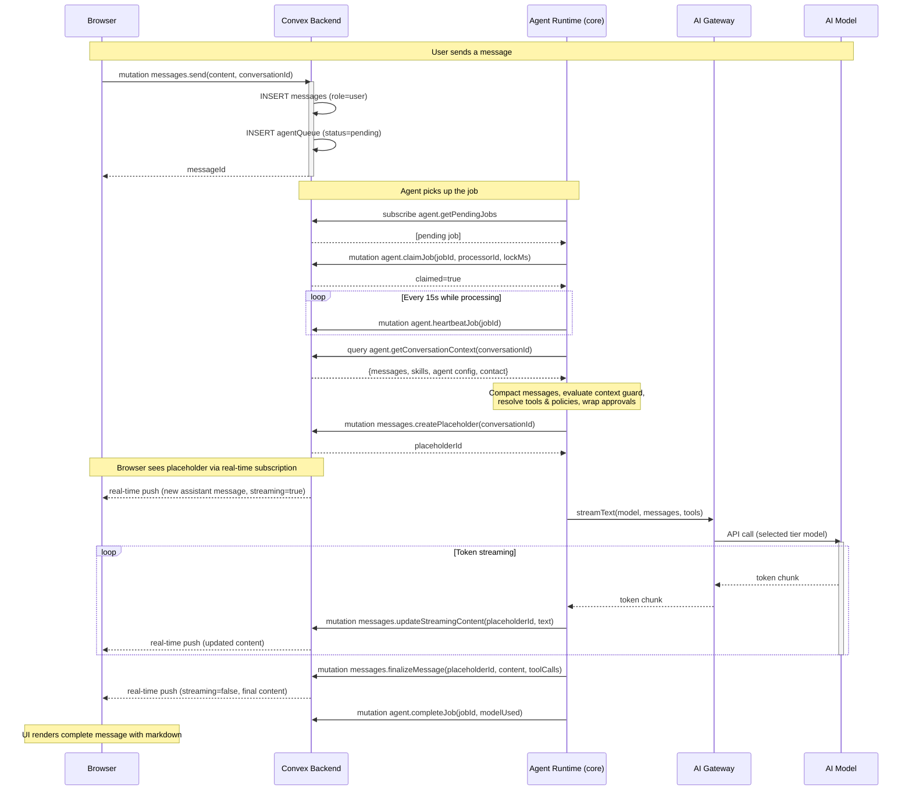

# Architecture Communication Flows

Service-level diagrams for the Web and WhatsApp channels. Both channels share the same Convex backend and agent runtime but differ in ingress/egress paths.

## Service Map

```
Browser (Next.js)  ──WebSocket──▶  Convex (.convex.cloud)  ◀──subscribe──  Agent Runtime (Railway)
                                   Convex (.convex.site)   ◀──webhook────  Meta WhatsApp Cloud API
```

| Service                | Role                                          | Deployment   |
| ---------------------- | --------------------------------------------- | ------------ |
| Browser / Next.js      | Chat UI, real-time subscriptions              | Vercel       |
| Convex Backend         | Schema, mutations, queries, HTTP actions      | Convex Cloud |
| Agent Runtime (core)   | Job processing, AI generation, tool execution | Railway      |
| Agent Runtime (egress) | WhatsApp outbound message delivery            | Railway      |
| Meta Graph API         | WhatsApp Cloud API (send/receive)             | Meta         |
| Vercel AI Gateway      | Model routing proxy to AI providers           | Vercel       |

---

## Web Channel Flow



### Key Details

- **Real-time updates**: Convex pushes message changes to the browser via WebSocket subscription on `messages.listByConversation`.
- **Streaming throttle**: Content patches are sent every 200ms to avoid overwhelming the backend.
- **Model selection**: `model-router.ts` picks Standard tier (`AI_MODEL`) for web. Falls back to Power tier on error.
- **Tool approvals (web)**: If a tool requires approval, the agent creates a `toolApprovals` record. The UI renders an ApprovalCard. The user clicks Approve/Reject, which resolves the record. The agent polls and continues.

---

## WhatsApp Channel Flow


### Key Details

- **Webhook security**: Every inbound webhook is verified with HMAC-SHA256 using `WHATSAPP_CLOUD_APP_SECRET`.
- **Deduplication**: The `inboundDedupe` table prevents Meta webhook retries from creating duplicate messages/jobs.
- **Contact gating**: Unknown contacts are auto-created as `isAllowed: false` and silently dropped until allowed.
- **Tool approval (WhatsApp)**: Users reply YES/NO in chat. The webhook handler intercepts these before enqueuing and resolves the pending approval directly.
- **Non-streaming**: WhatsApp uses `generateText` (batch), not `streamText`, since there's no real-time connection to the user.
- **Model selection**: `model-router.ts` picks Lite tier (`AI_LITE_MODEL`) for WhatsApp. Falls back through Standard → Power on error.
- **Egress lease**: Only one egress worker can send for a given `accountId` at a time, enforced by `whatsappLeases` distributed lock with heartbeat.
- **Formatting**: `sanitizeForWhatsApp()` converts markdown to WhatsApp-compatible formatting before sending.

---

## Shared Infrastructure


---

## Database State Transitions


